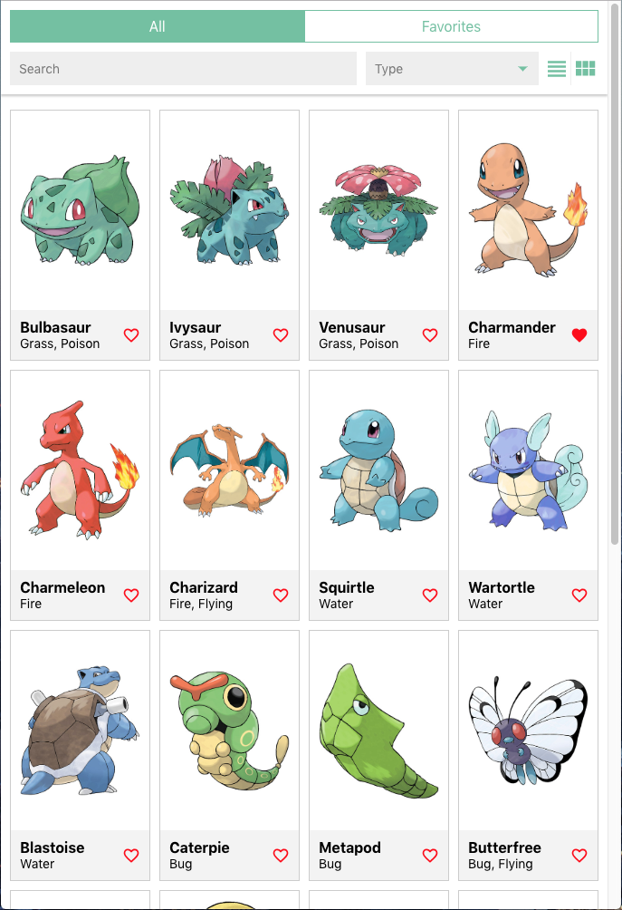
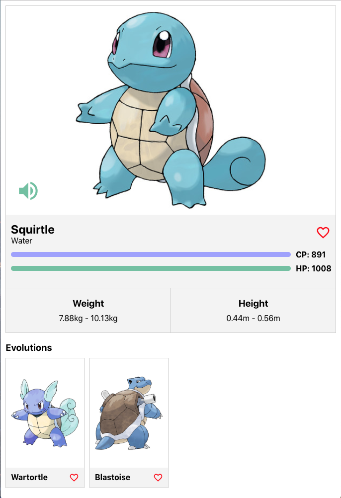

# HEYTRADE CODING EXERCISE

[](https://github.com/CarlosR-B/HeyTrade/actions/workflows/gradle.yml)

THIS EXERCISE WAS CREATED BY OUR COLLEAGUES OF MYMOID
AS we are sharing technologies in the backend we are using
their awesome work for our own technical assessments.
(Mymoid is another fintech brand of Beka)

This is a beauty exercise but all rights and claps 
SHOULD be sent to mymoid!

We all know that written documentation does not work
in software development, and is better having conversation
and build a shared knowledge of the product you want to build.

As in this case is not possible the most important thing
is not how you decide to do things but to be ready to answer
when we ask "why do you do this in this way?"

# Coding Exercise Mymoid backend

This repository contains a coding exercise for new developers joining the backend development team. This version is focused in Spring.

### System Requirements

- [git][git] v2.13 or greater
- [NodeJS][node] `^10.13 || 12 || 14 || 15`
- [npm][npm] v6 or greater

All of these must be available in your `PATH`. To verify things are set up
properly, you can run this:

```shell
git --version
node --version
npm --version
```

If you have trouble with any of these, learn more about the PATH environment
variable and how to fix it here for [windows][win-path] or
[mac/linux][mac-path].

## What we want you to build

Your mission is to build a small [Pokedex](https://www.pokemon.com/us/pokedex/) rest api that serve data to next web application:

List View           |  Detail View
:-------------------------:|:-------------------------:
 |  

A video example can be found in the [example](https://github.com/technoactivity/pokedex-server/tree/main/example) folder in the root of the directory as `example.mov`

The features we expect that your api would contain would be:

- Search for Pokemon by text.
- Filter Pokemon by type.
- Add and remove a Pokemon to and from your Favorites.
- Retrieve `All` Pokemons and `Favorite` Pokemons.
- Get Pokemon details.

In addition to the above features, below are some optional features that we'd love to see:
- Real database as source of true, not in memory (usind JPA in data layer).
- Containerize and deploy your applications using Docker.
- Graphql version of the api

## What we provide in this repository

### Example backend (`/example-backend`)
As example to guide you, we have provided you with a simple [GraphQL](https://graphql.org/learn) server that serves Pokemon data. The server is non-persistent and therefore on server restart, data will reset.

**You can view the data structures with this example**

To run the server:

```
$ cd example-backend
$ npm install
$ npm start
```

After running the backend, you can access https://localhost:4000/graphql in the browser, you'll be presented with a GraphQL Playground that allows you to run Queries and Mutations as well as view the GraphQL Schema.

A sample query:
```
query { pokemons(query: { limit: 10, offset: 0 }) { edges { name } } }
```

### Backend 

Where should you write your solution.

### Technology and boilerplate

You are free to use whatever stack you want but what we value the most is [Spring](https://spring.io/). 

Use only what you are comfortable with and feel free to use any additional libraries you deem necessary to complete the exercise. We would like to see your model designer skills so make sure you show them to us! (You can use any JPA dependency).

### Hints
- There is no need to configure a build, the development environment is sufficient.
- **Tests** are important and if time allows it, we'd like to see *some* test coverage.
- Feel free to ask us if you have any doubt or you face any problem!

## Coding the solucion

Create a repository for your own exercise, after that launch the setup!

You can use GitLab or GitHub or any other service, just be sure we can access the repo.

### Setup coding exercise

```
cd pokedex-server
node setup
```
